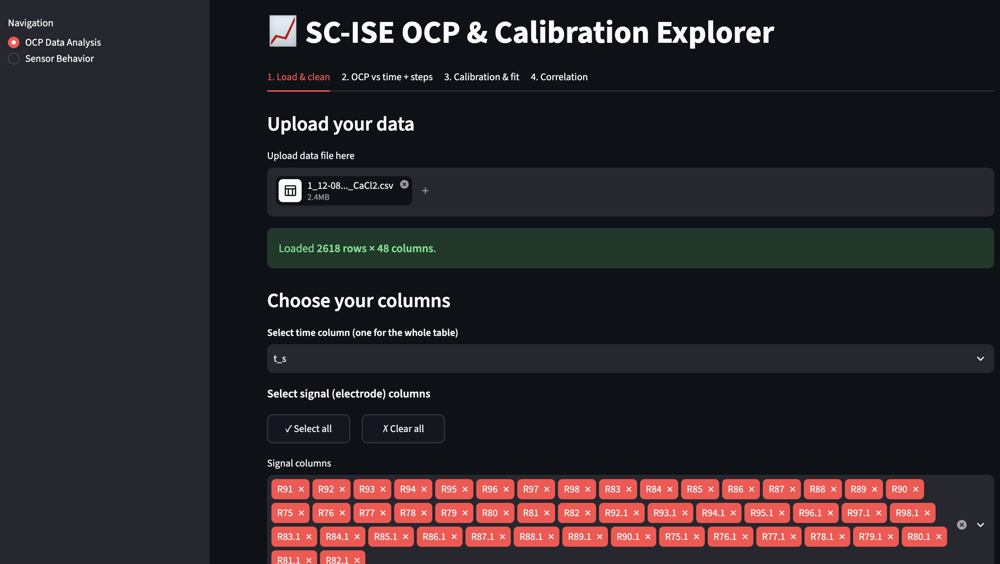
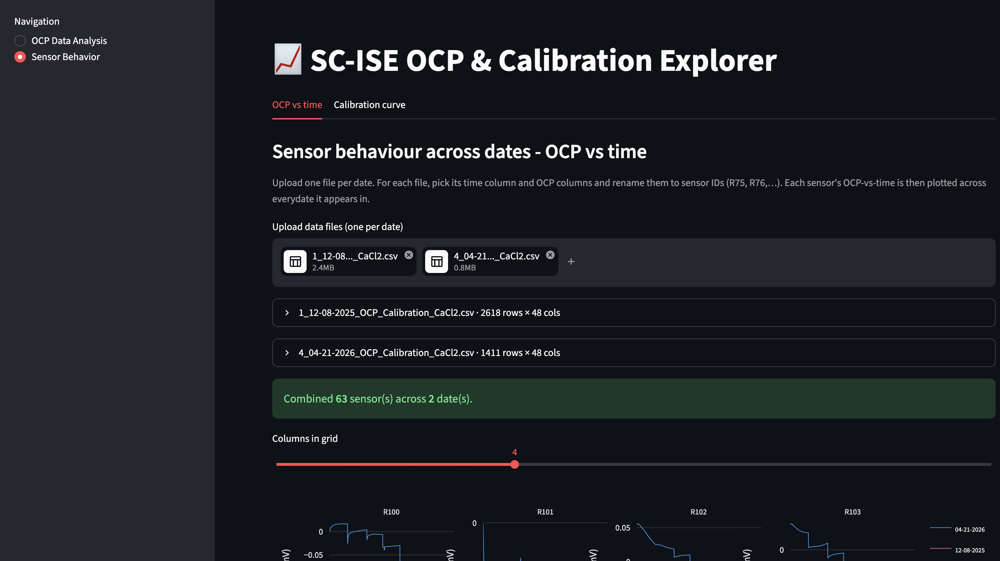

# SC-ISE Calibration Analysis & Concentration Prediction

Automated processing, analysis, and ML-based concentration prediction for
solid-contact ion-selective electrode (SC-ISE) calibration data, built during
a NDnano Undergraduate Research Fellowship (NURF) program at University of Notre Dame.

## Overview

Solid-contact ion-selective electrodes (SC-ISEs) are used for real-time,
low-cost water-quality monitoring, but converting raw sensor potential into
an ion concentration requires calibrating each electrode (estimating slope,
intercept, and linear range) i.e. normally a manual, repetitive, per-electrode
process. This project automates that workflow with:

- **An interactive Streamlit app** that ingests raw multi-electrode
  potentiostat exports (.xlsx/.csv), cleans and reorganizes them,
  auto-detects concentration-switch times, and produces calibration curves
  (slope, intercept, R²) per electrode i.e. no manual curve-picking.
- **A machine-learning pipeline** that engineers 16 features per
  concentration window (absolute-potential statistics + response-shape
  statistics + inter-step deltas) from 5 calibration runs / 44 electrodes
  (573 windows total) and predicts log-concentration directly from the
  electrode response.
- **A Water Layer Test (WLT) analysis** notebook for tracking electrode
  drift/stability over time.

## Demo
This is how the Streamlit dashboard looks like.
 

## Repository structure

```
.
├── app/                     # Streamlit application
│   ├── app.py                #  UI layer (upload, clean, detect steps, calibrate)
│   └── tools/
│       ├── ocp_tools.py       #  pure data-processing logic (no Streamlit)
│       └── plots.py           #  Plotly figure builders
├── data/
│   ├── raw/                  # original potentiostat exports (.xlsx / .csv)
│   ├── interim/               # column-renamed, not-yet-cleaned exports
│   └── processed/
│       ├── cleaned/            # bad-region-removed calibration data
│       └── features_dataset.csv
├── notebooks/
│   ├── 01_clean_naming.ipynb       # raw export -> renamed columns
│   ├── 02_sensor_configuration.ipynb  # per-sensor reorganization / prototyping
│   └── 03_model.ipynb              # feature engineering + model comparison
├── wlt/                      # Water Layer Test analysis
│   ├── wlt_analysis.ipynb
│   └── results/               # exported plots (drift rate, OCP shifts, ...)
├── docs/                     # poster / presentation (as PDF, not raw .pptx)
├── requirements.txt
├── LICENSE
└── README.md
```

## Installation

```bash
git clone https://github.com/yashdodiya9/sc-ise-electrode-calibration
cd sc-ise-electrode-calibration
python -m venv .venv && source .venv/bin/activate   # Windows: .venv\Scripts\activate
pip install -r requirements.txt
```

## Usage

```bash
streamlit run app.py
```

Then, in the browser UI:
1. Upload a raw `.xlsx`/`.csv` potentiostat export.
2. Pick the time column and the electrode (signal) columns and do the necessary preprocessing.
3. Review/adjust auto-detected concentration-switch times.
4. Get calibration curves (slope, intercept, R², LOD) per electrode, and download the cleaned data / curves.

You can also use the app :
https://sc-ise-electrode-calibration.streamlit.app/
[](https://sc-ise-electrode-calibration.streamlit.app/)
## Data

- **Source**: raw OCP (open-circuit potential) traces from CaCl₂ calibration
  runs, 5 experiments between Dec 2025 and Jun 2026, 44 electrodes,
  concentration range 10⁻⁸–10⁻¹ M.
- **Pipeline**: `data/raw` (as exported) → `notebooks/01_clean_naming.ipynb`
  (renames columns to electrode IDs, e.g. `R75`) → `data/interim` →
  bad-region removal (`03_model.ipynb`) → `data/processed/cleaned` →
  feature extraction → `data/processed/features_dataset.csv`
  (573 rows = one concentration window × one electrode, 16 features each).

## ML - results

Six regressors (Ridge, kNN, SVR-RBF, Random Forest, Extra Trees,
HistGradientBoosting) were compared predicting log-concentration from the
16 engineered features, using **grouped cross-validation** (held out by
electrode, and separately by calibration run) so no electrode/run appears
in both train and test — this avoids the leakage a naive random split would
introduce.

Best result (Extra Trees, held-out electrode / held-out run):

| Split held out | Model      | R²    | MAE (log-C) | RMSE (log-C) |
|----------------|------------|-------|--------------|----------------|
| Electrode      | ExtraTrees | 0.938 | 0.280        | 0.477          |
| Calibration run| ExtraTrees | 0.875 | 0.475        | 0.679          |

## Tech stack

Python, Streamlit, pandas, NumPy, SciPy, Plotly, Matplotlib, scikit-learn

## Acknowledgments

Developed during the NDnano Undergraduate Research Fellowship (NURF),
Department of Chemical & Biomolecular Engineering, University of Notre
Dame, under Prof. Jennifer L. Schaefer and Prof. Nosang V. Myung, with
Raúl S. Chávez Ramírez and Govinda P. Devkota.
